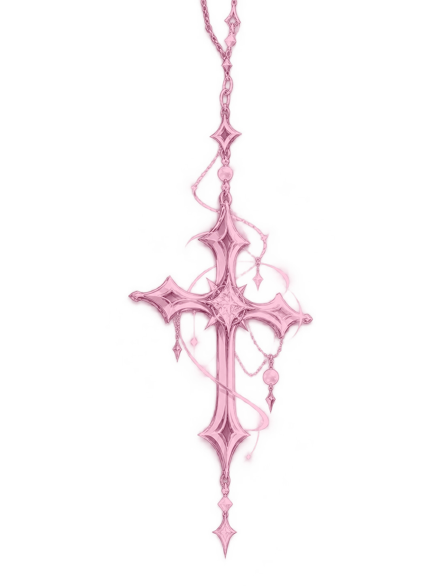

<div align="center">

<a href="https://git.io/typing-svg"></a>

<br>


</div>

---

<table>
<tr>
<td width="57%" valign="middle">

### ✧ About Me

<pre>
◈ Alias     → OXYMERALD
◈ Class     → Developer / Founder
◈ Location  → Atyrau, Kazakhstan
◈ Focus     → CS / Cybersecurity / AI
◈ Mission   → Make ideas real
</pre>

16 y.o. developer interested in software, cybersecurity and artificial intelligence.

*Somewhere between chaos and creation.*

</td>
<td width="43%" align="center" valign="middle">

</td>
</tr>
</table>

---

### ✧ Languages

<div align="center">

</div>

<br>

### ✧ Technologies & Tools

<div align="center">

</div>

---

### ✧ Selected Projects

**QOSYU** — Smart waste collection and route optimization.  
**Komek-AI** — Cybersecurity assistant for phishing and suspicious files.  
**Northstar** — Tools and workflows for students.

---

### ✧ GitHub Statistics

<div align="center">

</div>

---

### ✧ Contribution Graph

<div align="center">
<a href="https://github.com/oxymerald?tab=overview"></a>
</div>

---

<details>
<summary>✧ Hidden sigil</summary>

```text
⣾⠁⠀⣸⠆⠀⣤⣤⣀⡀⠀⠀⠀⠀⠀⠀⠀⠀⠀
⠀⠀⠀⣿⣄⠀⣼⡟⠀⠀⠀⠉⠉⠛ ⠷⣤⡀⠀⠀⠀⠀
⢀⣾⠀⠘⢿⣷⣿⣷⣠⡶⠛⠛⠛⠷⣦⠈⢻⠂⠀⠀⠀⠀
⢸⠇⠀⠀⡟⢛⣻⣿⠸⣧ ⣦⠀⠀⠀
⣾⠀⠀⠰⣿⣿⣿⣿⢠⡿⠀⠀ ⣿⠀⠀⠀
⢸⡀⠀⠀⢻⣿⠿⣿⣿⣦⣀⡀⣀⣠⡾⠁⠀⠀⣿⠀⠀⠀
⠘⣧⡀⠀⠀⠀⠀⣼⣿⣯⡉⠉⠉⠙⣇⡀⠀⢰⡏⠀⠀
⠀⠘⢷⡄⠀⣠⣾⣿⣿⣿⣿⠄⠀⠀⢹⣷⡄⠘
⠀⠀⠀⠀⢾⣿⣿⣿⣿⣿⠟⠀⣀⣠⠀⢻⣿⠀⠀⠀⠀⠀
⠀⠀⠀⠀⠀⠈⠉⠛⠛⠁⠀⠚⠋⠉⠀⠀⠻⡿
```

</details>

<div align="center"><sub>「 O X Y M E R A L D 」 — A young mind in a big universe.</sub></div>
